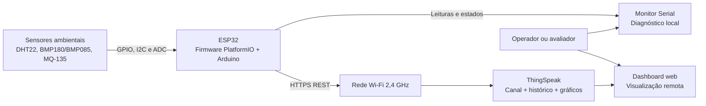
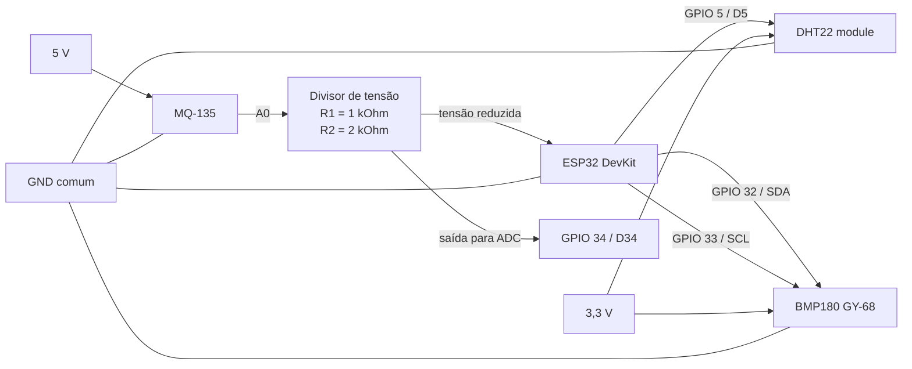
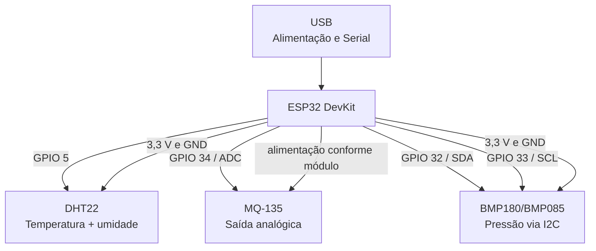
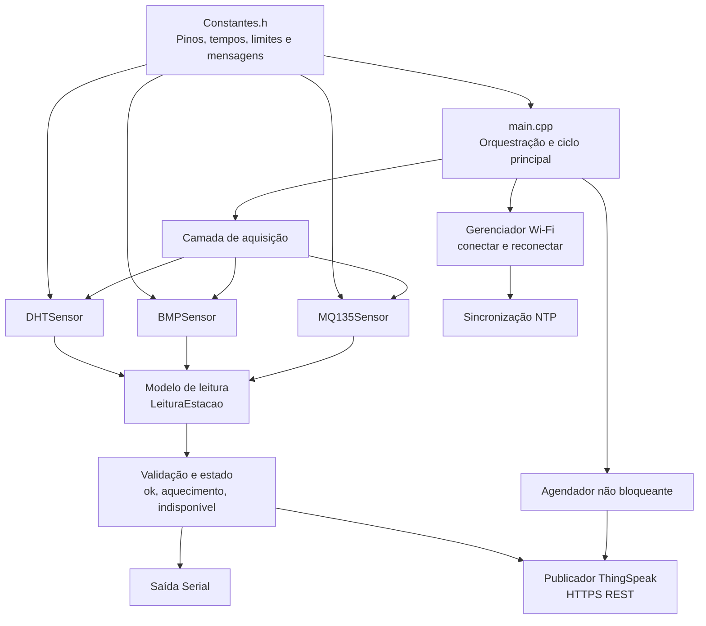
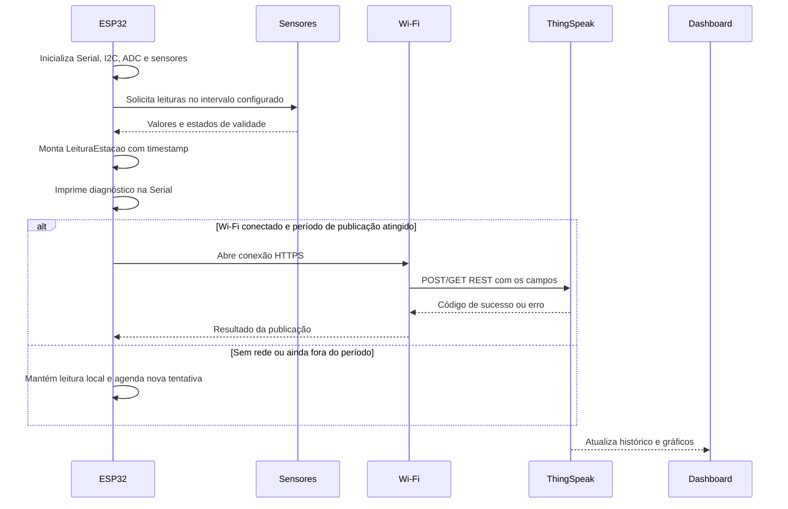
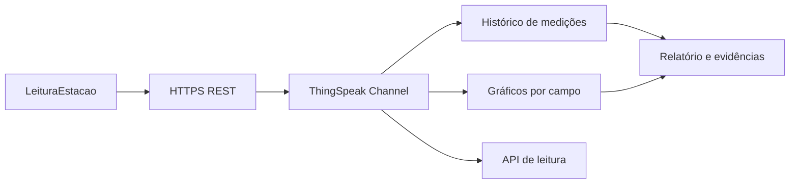

# Arquitetura geral da Central Meteorológica de Baixo Custo

## 1. Objetivo

Este documento define a arquitetura técnica da Central Meteorológica de Baixo Custo descrita no desafio da UniFECAF e estabelece como o projeto `estacao-metereologica-esp32` será utilizado como firmware oficial do microcontrolador.

A solução deve:

- medir temperatura, umidade, pressão atmosférica e um indicador complementar de qualidade do ar;
- publicar medições remotamente por Wi-Fi;
- armazenar o histórico em uma plataforma de nuvem;
- disponibilizar visualização em tempo real por dashboard;
- continuar operando localmente pela Serial quando a rede ou a nuvem estiverem indisponíveis;
- permitir testes, diagnóstico e evolução sem acoplar a lógica dos sensores ao serviço de nuvem.

## 2. Decisões arquiteturais

| Decisão | Escolha | Justificativa |
|---|---|---|
| Microcontrolador | ESP32 DevKit (`esp32dev`) | Wi-Fi integrado, ADC, I2C e capacidade suficiente para aquisição e telemetria. |
| Framework | Arduino sobre PlatformIO | Já utilizado no firmware e adequado ao escopo embarcado do projeto. |
| Sensor de temperatura e umidade | DHT22 | Atende duas variáveis obrigatórias com baixo custo e biblioteca madura. |
| Sensor de pressão | BMP180/BMP085 via I2C | Mede pressão atmosférica e pode fornecer temperatura de referência. |
| Sensor complementar | MQ-135 no ADC | Complementa o projeto com indicador relativo de qualidade do ar. Não será tratado como instrumento de concentração calibrada sem ensaio específico. |
| Comunicação local | I2C, GPIO digital e ADC | Respeita as interfaces elétricas naturais de cada sensor. |
| Comunicação remota | Wi-Fi 2,4 GHz do ESP32 | Atende ao requisito de transmissão sem fio sem hardware adicional. |
| Protocolo de aplicação | HTTPS com requisição REST | Integração simples com a nuvem e adequada ao baixo volume de dados. |
| Nuvem e armazenamento | ThingSpeak | Oferece canal, histórico, gráficos e API HTTP com baixa complexidade para um projeto acadêmico. |
| Visualização | Dashboard nativo do ThingSpeak | Cumpre a interface remota inicial; um dashboard próprio pode ser adicionado posteriormente. |
| Diagnóstico | Serial em 115200 baud | Preserva o comportamento já implementado no firmware e facilita os ensaios. |
| Relógio | NTP pela rede Wi-Fi | Permite associar horário confiável às medições sem RTC obrigatório. |
| Formato lógico da leitura | Estrutura de dados tipada no firmware | Evita que cada destino interprete sensores de forma diferente. |

### 2.1. Fonte de verdade do firmware

O diretório `estacao-metereologica-esp32` é considerado a fonte de verdade para pinos, bibliotecas e comportamento implementado. No estado atual:

- DHT22: GPIO 5;
- MQ-135: GPIO 34, somente entrada analógica;
- I2C: SDA no GPIO 32 e SCL no GPIO 33;
- monitor Serial: 115200 baud;
- intervalo atual de leitura: 2000 ms;
- aquecimento inicial do MQ-135: 20000 ms.

O enunciado menciona GPIO 4 para o DHT22, mas o código atual usa GPIO 5. A montagem física, o diagrama final e o relatório devem escolher uma única configuração. Esta arquitetura mantém GPIO 5 para não divergir do firmware existente; caso a montagem use GPIO 4, a alteração deve ser feita em `include/Constantes.h` e validada novamente.

## 3. Visão de contexto

O ESP32 concentra aquisição, validação básica, diagnóstico e envio. O ThingSpeak armazena os campos e fornece os gráficos para acompanhamento remoto.



### 3.1. Responsabilidades por componente

| Componente | Responsabilidades | Fora do escopo inicial |
|---|---|---|
| Sensores | Produzir sinais físicos de temperatura, umidade, pressão e resposta analógica do MQ-135. | Calibração metrológica de laboratório. |
| ESP32 | Inicializar sensores, coletar, validar, classificar estado, exibir na Serial, conectar ao Wi-Fi e publicar. | Servir uma aplicação web completa localmente. |
| Wi-Fi | Transportar as requisições do ESP32 até a internet. | Garantir disponibilidade do provedor. |
| ThingSpeak | Receber campos, manter histórico e gerar gráficos. | Substituir calibração ou corrigir leituras inválidas. |
| Dashboard | Apresentar valores atuais e tendências. | Comandar atuadores, que não fazem parte do desafio atual. |
| Relatório e testes | Documentar circuito, código, ensaios, limitações e resultados. | Declarar precisão maior que a comprovada pelos ensaios. |

## 4. Arquitetura de hardware

### 4.1. Montagem elétrica atual

O esquema anexado (`schema-circuito-eletrico.svg`, revisão 1.0, datado de 2026-08-30) foi confrontado com `include/Constantes.h` e com as classes de sensores do firmware. A montagem atual está alinhada com o código nos sinais principais:

- DHT22 DATA está conectado ao GPIO 5 (`D5` no símbolo do ESP32), que corresponde a `PIN_DHT`;
- BMP180 (módulo GY-68) usa SDA no GPIO 32 e SCL no GPIO 33, correspondendo às constantes I2C;
- MQ-135 usa a saída `A0` passando pelo divisor resistivo até o GPIO 34 (`D34`), correspondendo a `PIN_MQ135`;
- o BMP180 e o DHT22 são alimentados pela linha de 3,3 V do ESP32;
- o MQ-135 é alimentado por uma linha indicada como +5 V;
- todos os módulos compartilham o GND do ESP32.



### 4.2. Ligações verificadas no esquema

| Elemento no esquema | Ligação atual | Firmware correspondente | Situação |
|---|---|---|---|
| `U2` ESP32 DevKit | Controlador principal | `board = esp32dev` | Consistente |
| `U4` DHT22_MODULE | VCC em 3,3 V, DATA em GPIO 5, GND comum | `PIN_DHT = 5`, tipo `DHT22` | Consistente |
| `U3` BMP180 (GY-68) | SDA em GPIO 32, SCL em GPIO 33, VIN em 3,3 V | `Wire.begin(32, 33)` | Consistente |
| `U1` MQ135 | VCC em +5 V, GND comum, A0 no divisor e depois GPIO 34 | `PIN_MQ135 = 34`, ADC de 12 bits | Consistente |
| `R1` | 1 kOhm em série com o sinal A0 | Proteção/atenuação do ADC | Validado |
| `R2` | 2 kOhm para GND | Divisor de tensão do sinal A0 | Validado |

### 4.3. Divisor de tensão do MQ-135

O esquema mostra o MQ-135 alimentado em 5 V e sua saída `A0` encaminhada ao ADC do ESP32 por um divisor formado por `R1 = 1 kOhm` e `R2 = 2 kOhm`. Considerando R1 no lado do sinal do sensor e R2 no lado do GND, a tensão que chega ao GPIO 34 é:

$$
V_{ADC} = V_{A0} \times \frac{R2}{R1 + R2}
       = V_{A0} \times \frac{2}{3}
$$

Assim, uma saída de 5 V é reduzida teoricamente para aproximadamente 3,33 V. A montagem, a escolha do GPIO 34, a alimentação de 5 V do MQ-135 e o divisor foram considerados validados com base na documentação técnica do projeto, especialmente em [MQ135-leitura-analogica.md](MQ135-leitura-analogica.md) e [MQ135-overview.md](MQ135-overview.md).

O valor `4095` usado no firmware corresponde à resolução ADC de 12 bits configurada para o ESP32. O percentual produzido pelo código deve ser interpretado como indicador relativo do sinal analógico do módulo, e não como concentração calibrada em ppm.

### 4.4. Pontos de atenção sobre a montagem atual

- As especificações elétricas da montagem são consideradas validadas pelos documentos técnicos do projeto: [DHT22-ovwerview.md](DHT22-ovwerview.md), [MQ135-overview.md](MQ135-overview.md), [MQ135-leitura-analogica.md](MQ135-leitura-analogica.md) e [BMP180-datasheet.md](BMP180-datasheet.md).
- O DHT22 é alimentado em 3,3 V e utiliza a interface digital no GPIO 5 conforme o esquema e o firmware.
- O BMP180/GY-68 utiliza o barramento I2C nos GPIOs 32 e 33, com alimentação definida no projeto.
- O MQ-135 opera com aquecedor em 5 V; o sinal analógico A0 passa pelo divisor antes de chegar ao ADC1 do ESP32 no GPIO 34.
- O resistor de pull-up do DHT22 e os pull-ups do I2C são tratados como parte da montagem validada dos módulos utilizados.
- O símbolo do ESP32 nomeia os pinos como `D32`, `D33` e `D34`; no firmware eles são usados como GPIO numérico 32, 33 e 34.
- O diagrama elétrico atual não inclui display, alimentação regulada independente, proteção contra inversão, fusível, caixa ou sensores de chuva/vento. Esses itens pertencem a uma evolução e não devem ser apresentados como já implementados.
- A origem da linha `+5V` deve ser apresentada no relatório apenas como informação de alimentação do protótipo; ela não altera a arquitetura lógica descrita neste documento.

### 4.5. Ligações previstas



### 4.6. Integração elétrica documentada

- O GND é comum entre o ESP32 e os sensores.
- O GPIO 34 é somente entrada, pertence ao ADC1 e é adequado à leitura do MQ-135 durante o uso de Wi-Fi.
- O endereço I2C do BMP deve ser confirmado pelo scanner já existente no firmware durante a validação funcional.
- O aquecimento e o burn-in do MQ-135 devem ser registrados nos ensaios, conforme a documentação do sensor.
- O MQ-135 deve ser instalado afastado de fontes de calor que não façam parte do próprio aquecedor do sensor.

### 4.7. Interfaces e sinais

| Sensor | Interface | Dados | Tratamento |
|---|---|---|---|
| DHT22 | GPIO digital | Temperatura e umidade | Verificação de `NaN` e estado `ok`. |
| BMP180/BMP085 | I2C | Pressão em hPa | Inicialização e validação do evento de pressão. |
| MQ-135 | ADC 12 bits | Valor `raw` e percentual relativo | Média de amostras, rejeição de extremos e classificação qualitativa. |

## 5. Arquitetura do firmware

O firmware atual já separa cada sensor em uma classe. A evolução proposta preserva essa fronteira e adiciona serviços independentes para rede, telemetria e agendamento.



### 5.1. Módulos propostos

| Módulo | Papel | Situação |
|---|---|---|
| `DHTSensor` | Abstrair inicialização e leitura do DHT22. | Existente. |
| `BMPSensor` | Abstrair inicialização e leitura do BMP180/BMP085. | Existente. |
| `MQ135Sensor` | Aquecer, amostrar, filtrar e classificar o MQ-135. | Existente. |
| `ModeloLeitura` | Reunir os valores em uma leitura única com timestamp e estados. | A implementar. |
| `GerenciadorWiFi` | Conectar, detectar queda e reconectar sem travar a aquisição. | A implementar. |
| `RelogioNtp` | Sincronizar hora após conexão. | A implementar. |
| `PublicadorThingSpeak` | Mapear campos e enviar a leitura via HTTPS. | A implementar. |
| `Agendador` | Separar frequência de leitura, Serial e publicação usando `millis()`. | A implementar. |
| `SaidaSerial` | Manter uma saída legível para diagnóstico e ensaios. | Parcialmente existente no `main.cpp`. |

### 5.2. Regras de execução

1. O `setup()` inicializa Serial, I2C, sensores, ADC e estado da rede.
2. A aquisição ocorre em intervalo fixo, sem depender de a nuvem estar disponível.
3. Uma falha de sensor gera estado inválido no campo correspondente, mas não impede a leitura dos demais.
4. Uma falha de Wi-Fi ou ThingSpeak não deve bloquear o loop principal.
5. A publicação deve ser tentada em intervalo próprio, maior que o intervalo de aquisição, para evitar excesso de requisições.
6. Credenciais Wi-Fi e chave de escrita do ThingSpeak não devem ser versionadas no repositório. Usar arquivo local ignorado, variáveis de build ou configuração segura do ambiente de desenvolvimento.
7. O primeiro protótipo pode usar `delay()` apenas durante a estabilização inicial; o ciclo operacional deve migrar para `millis()` para permitir aquisição, reconexão e publicação cooperativas.

## 6. Fluxo operacional



## 7. Contrato de dados

### 7.1. Estrutura interna

A leitura normalizada deve conter, no mínimo:

```text
LeituraEstacao
- timestampUtc
- temperaturaCelsius
- umidadePercentual
- pressaoHpa
- mq135Raw
- mq135Percentual
- qualidadeAr
- dhtOk
- bmpOk
- mq135Ok
- wifiConectado
```

Valores indisponíveis devem ser representados por estado explícito, e não por um número que possa ser confundido com uma medição real.

### 7.2. Mapeamento do canal ThingSpeak

| Campo ThingSpeak | Conteúdo | Unidade/observação |
|---|---|---|
| `field1` | Temperatura do DHT22 | °C |
| `field2` | Umidade do DHT22 | % |
| `field3` | Pressão do BMP180/BMP085 | hPa |
| `field4` | MQ-135 bruto | ADC de 0 a 4095 |
| `field5` | MQ-135 percentual relativo | Não é ppm calibrado |
| `field6` | Qualidade do ar codificada | 0 indisponível, 1 boa, 2 moderada, 3 ruim, 4 péssima |
| `field7` | Máscara de saúde dos sensores | Bit 0 DHT, bit 1 BMP, bit 2 MQ-135 |
| `field8` | RSSI do Wi-Fi | dBm |

O canal deve receber uma descrição das unidades e da limitação do MQ-135. O intervalo de publicação deve respeitar a política vigente da plataforma e ser configurado como constante, por exemplo `INTERVALO_PUBLICACAO_MS`, sem número mágico espalhado pelo código.

## 8. Armazenamento e visualização

### 8.1. Fluxo na nuvem



### 8.2. Dashboard mínimo

O dashboard deve apresentar:

- temperatura atual e série temporal;
- umidade atual e série temporal;
- pressão atmosférica e tendência;
- estado qualitativo do MQ-135, deixando claro que é indicador relativo;
- horário da última atualização;
- indicação de sensor inválido ou estação sem atualização recente.

Para a entrega inicial, os widgets nativos do ThingSpeak são suficientes. Uma segunda etapa pode consumir a API do canal em uma página própria, mas isso não deve atrasar a comprovação dos requisitos obrigatórios.

## 9. Disponibilidade e tratamento de falhas

| Falha | Comportamento esperado | Evidência no teste |
|---|---|---|
| DHT22 desconectado | `dhtOk=false`; BMP e MQ continuam sendo lidos. | Serial e campo de saúde. |
| BMP sem resposta I2C | `bmpOk=false`; scanner e mensagem de diagnóstico. | Serial e campo de saúde. |
| MQ-135 aquecendo | Não publicar o valor como qualidade válida; informar estado de aquecimento. | Serial e leitura inicial. |
| MQ-135 fora do ADC ou instável | Marcar inválido; preservar `raw` somente quando validado. | Ensaio de variação e saturação. |
| Wi-Fi indisponível | Continuar aquisição e Serial; tentar reconexão em intervalos controlados. | Desligar ponto de acesso durante o ensaio. |
| ThingSpeak indisponível | Não travar o loop; registrar código/estado e tentar depois. | Bloquear internet mantendo Wi-Fi. |
| Reinicialização do ESP32 | Reexecutar inicialização e voltar a publicar após NTP/Wi-Fi. | Desligar e religar a placa. |
| Credencial ausente | Compilar sem segredo no código público e sinalizar configuração incompleta. | Build limpo em máquina sem arquivo local. |

## 10. Segurança e configuração

- Manter SSID, senha Wi-Fi e chave de escrita em configuração local não versionada.
- Preferir HTTPS e validar o certificado quando a biblioteca e a capacidade de memória permitirem.
- Usar uma chave de escrita exclusiva do canal; a chave de leitura pode ser pública para o dashboard.
- Não imprimir credenciais na Serial.
- Limitar a taxa de publicação e tratar códigos HTTP de erro.
- Documentar no relatório quais dados são públicos e quais ficam restritos.

## 11. Estratégia de testes e validação

### 11.1. Testes do firmware

1. Compilar o projeto com PlatformIO para `esp32dev`.
2. Validar o scanner I2C e confirmar o endereço do BMP.
3. Testar o DHT22 em ambiente estável, comparando com um termohigrômetro de referência.
4. Testar a pressão do BMP em comparação com uma fonte de referência ou serviço meteorológico próximo, registrando condições e horário.
5. Registrar a curva de aquecimento e a repetibilidade do MQ-135; não converter o percentual diretamente em ppm sem calibração.
6. Desconectar um sensor por vez e verificar isolamento de falhas.
7. Interromper Wi-Fi e internet separadamente, verificando que a aquisição local continua.
8. Confirmar a chegada de registros ao ThingSpeak e a atualização do dashboard.
9. Medir o intervalo real entre publicações e verificar que não há bloqueio prolongado no loop.

### 11.2. Critérios de aceitação

- Pelo menos três fontes de medição integradas e identificadas no circuito.
- Leituras visíveis na Serial com unidade e estado.
- Dados publicados remotamente via Wi-Fi.
- Histórico persistido no ThingSpeak.
- Dashboard acessível com dados recentes.
- Falha de um sensor não interrompe os outros.
- Falha de rede não impede o funcionamento local.
- Relatório contém diagrama, código, procedimentos, resultados e limitações.

## 12. Rastreabilidade com o desafio

| Requisito do desafio | Implementação nesta arquitetura | Evidência |
|---|---|---|
| Microcontrolador compatível | ESP32 DevKit com PlatformIO | `platformio.ini`, montagem e relatório |
| Pelo menos três sensores | DHT22, BMP180/BMP085 e MQ-135 | Diagrama e leituras |
| C/C++ embarcado | Firmware Arduino C++ | Código-fonte do projeto |
| Armazenamento em nuvem | ThingSpeak Channel | URL do canal e histórico |
| Exibição em tempo real | Dashboard ThingSpeak + Serial | Capturas e vídeo |
| Transmissão sem fio | Wi-Fi integrado do ESP32 | Logs de conexão e publicação |
| Documentação | Este documento, esquema, testes e relatório final | Entrega acadêmica |
| Comparação com solução comercial | Pesquisa de estação meteorológica comercial de referência | Seção de estado da arte do relatório |

## 13. Evolução recomendada

### Fase 1: base já existente

- manter as classes de sensores;
- confirmar ligações elétricas e pinos;
- compilar, gravar e validar as leituras pela Serial;
- registrar ensaios individuais.

### Fase 2: telemetria mínima

- criar `LeituraEstacao`;
- adicionar `GerenciadorWiFi`;
- sincronizar NTP;
- adicionar `PublicadorThingSpeak`;
- publicar os campos 1 a 5 e o estado de saúde.

### Fase 3: robustez e demonstração

- trocar o ciclo baseado em `delay()` por agendamento com `millis()`;
- tratar reconexão e códigos HTTP;
- configurar dashboard;
- produzir vídeo mostrando sensores, Serial, publicação e gráficos.

### Fase 4: melhorias opcionais

- display OLED I2C local;
- armazenamento temporário em LittleFS ou cartão microSD para períodos sem internet;
- fila de reenvio de leituras;
- pluviômetro e anemômetro;
- dashboard próprio;
- calibração comparativa e análise estatística.

## 14. Limitações declaradas

- DHT22 possui precisão e tempo de resposta limitados para uso meteorológico profissional.
- BMP180/BMP085 fornece pressão local; comparação com pressão ao nível do mar exige altitude e correção adequadas.
- O MQ-135 é sensível a aquecimento, ambiente, umidade e gases diversos. O percentual definido no firmware é um indicador relativo baseado no ADC, não uma concentração certificada em ppm.
- Wi-Fi e ThingSpeak dependem de energia, cobertura e internet disponíveis.
- Sem RTC ou armazenamento local, uma queda prolongada de rede pode deixar lacunas no histórico até a próxima publicação.
- A montagem deve proteger sensores contra chuva direta, condensação, calor do regulador e interferência elétrica.

## 15. Resultado esperado

Ao final, a central deverá coletar leituras ambientais no ESP32, apresentar diagnóstico local pela Serial, enviar dados normalizados ao ThingSpeak por Wi-Fi e permitir acompanhar valores atuais e tendências em um dashboard. O relatório deverá separar claramente medição, indicador relativo, erro de sensor e indisponibilidade de rede, evitando atribuir ao protótipo uma precisão que não tenha sido demonstrada pelos ensaios.
